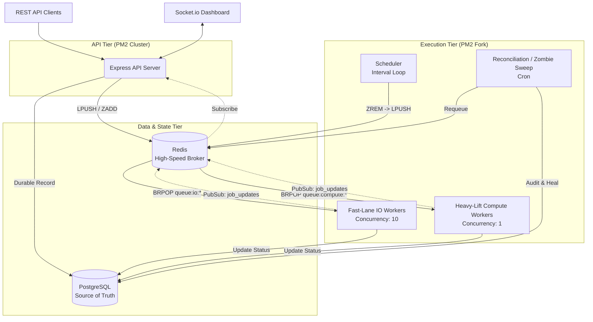

# 🚀 Distributed Job Queue

A highly robust, horizontally scalable, and resilient background job processing system built entirely from scratch. Designed to handle the rigors of modern backend infrastructure, this system eschews off-the-shelf libraries (like Bull or Celery) in favor of a custom, deeply integrated architecture. 

This is the kind of infrastructure that powers payment confirmations, asynchronous reporting, and mass transactional data processing—engineered for fault tolerance, high concurrency, and extreme observability.

---

## 🏗️ The Architecture

At the heart of the system is a **Dual-Store Architecture** that strictly decouples the fast dispatching of jobs from the durable storage of their state.



---

## 🧠 Why Two Stores?

**⚡ Redis is the Dispatcher**
Workers use `BRPOP` (a blocking pop) to instantly receive jobs in microseconds. They never query the database to find their next task, preventing DB locking contention. Redis acts as the expendable high-speed broker.

**🛡️ PostgreSQL is the Source of Truth**
Every state transition is durable. If Redis crashes and loses all in-memory queues, the entire system state can be perfectly reconstructed from PostgreSQL. Neither store can do the other's job: Postgres polling adds unacceptable latency, while Redis lacks an audit trail and robust queryability.

---

## ⚡ Core Features

- **Strict Resource Isolation (Fast-Lane vs Heavy-Lift):** CPU-bound tasks (`queue:compute`) run in strictly isolated single-concurrency PM2 processes. Network-bound tasks (`queue:io`) run in independent high-concurrency pools. An influx of image processing jobs will *never* delay a critical email.
- **True Priority Routing:** Each worker pool listens to multiple tiers (`high`, `default`, `low`). Redis `BRPOP` natively drains the high-priority queues completely before ever touching the lower tiers. No priority inversion.
- **Scheduled & Delayed Execution:** Jobs scheduled for the future go straight to `queue:delayed` (a Redis Sorted Set, scored by timestamp). A lightweight scheduler process safely promotes them to live queues precisely when they are due.
- **Exponential Backoff & Dead Letter Queue (DLQ):** Failed jobs are sent back to the delayed queue with an exponentially increasing delay. If a job exhausts its retry budget, it is permanently safely preserved in the DLQ (`queue:dead`) for developer inspection and manual replay.
- **Real-Time Observability Dashboard:** Workers publish their state changes to a Redis Pub/Sub channel. The API server subscribes to this channel and fans out the telemetry to connected frontend browsers via **Socket.io**.
- **Idempotent Execution:** Every handler is built to check whether its output already exists before doing work (e.g., checking for an existing output file or checking a Redis idempotency key). Safe to retry without side effects.
- **Split-Brain Reconciliation & Zombie Hunting:** If a worker machine experiences an OOM crash or power loss, jobs get trapped as eternally `running` in the DB but vanish from Redis. A dedicated periodic reconciliation script safely audits these "zombies" and reanimates them back into the retry loop.

---

## 🛠️ Tech Stack

| Component | Technology | Why We Chose It |
|---|---|---|
| **API & Workers** | Node.js + Express | Blazing fast async I/O, unified language across the stack. |
| **Queue Broker** | Redis (`ioredis`) | `BRPOP` provides atomic blocking dispatch; Sorted Sets solve scheduling. |
| **Database** | PostgreSQL + Prisma | JSONB storage for payloads, strict schemas, connection pooled via `pg`. |
| **Process Mgmt** | PM2 | Manages process topologies (clusters for API, forks for isolated workers). |
| **Real-Time** | Socket.io + Redis PubSub | Bridges the headless PM2 worker processes to the frontend UI dashboard. |
| **Observability** | Pino | High-performance, structured JSON logging ready for Datadog. |

---

## 🚀 Quick Start Guide

### 1. Prerequisites
- **Node.js** v18+
- **Docker** (for Postgres and Redis)

### 2. Infrastructure Spin-up
```bash
# Start Postgres + Redis + RedisInsight
docker compose up -d

# Install packages
npm install

# Setup Prisma Schema & DB
npx prisma migrate dev --name initial
npx prisma generate

# Configure Environment
cp .env.example .env
```

### 3. Launch the Fleet
The entire system topology is mapped inside `ecosystem.config.cjs`.
```bash
pm2 start ecosystem.config.cjs
pm2 status
```
You should observe exactly **10 processes** online: `api-server × 2`, `worker-io × 2`, `worker-compute × 4`, `scheduler × 1`, and `zombie-hunter`.

### 4. Open the Real-Time Dashboard
Visit: `http://localhost:3002/static/dashboard.html`

---

## 📡 API Reference

### Submit a Job
```bash
POST /api/jobs
Content-Type: application/json

{
  "jobType": "SCRAPE_WEBSITE",
  "payload": {
    "url": "https://books.toscrape.com",
    "targetSelector": ".price_color"
  },
  "priority": "high",                          # Optional: high | default | low
  "runAt": "2026-10-31T09:00:00.000Z"          # Optional: future scheduling
}
```

### Poll Job Status
```bash
GET /api/jobs/:id
```
*(Returns metadata including `status`, `pollAgainInMs`, `result`, and `processingTimeMs`)*

### System Health & Dead Letter Management
```bash
GET /api/system/health          # Metrics, queue depths, and PM2 scaling advice
POST /api/jobs/replay-dead      # Re-queue all failed jobs sitting in the DLQ
POST /api/system/zombie-sweep   # Trigger a manual reconciliation of stuck jobs
```

---

## 🔧 CLI Toolkit & Recovery

The project ships with robust npm scripts for administrative recovery:

```bash
# Replay all dead jobs from the DLQ (resets retries)
npm run queue:replay-dead

# Preview what jobs are dead without acting
npm run queue:inspect-dead

# Run the split-brain reconciliation / zombie sweep manually
npm run queue:zombie-hunt

# Dry run the reconciliation to preview actions
npm run queue:zombie-hunt:dry
```

---

## 📂 Project Structure

```text
src/
├── api/                  # Express HTTP Layer
│   ├── controllers/      # Route logic & HTTP semantics
│   ├── routes/           # Endpoint mappings
│   ├── services/         # Core business logic (DB + Redis orchestration)
│   └── validators/       # Request validation
├── config/               # Prisma, Redis, Logger, and Socket.io instances
├── scripts/              # CLI tools for Reconciliation & Load Testing
└── workers/              # The Execution Tier
    ├── index.js          # The core BRPOP consumption loop
    ├── scheduler.js      # Sorted Set promoter
    └── handlers/         # Specialized job execution logic (Email, Scrapers, PDF)
```
